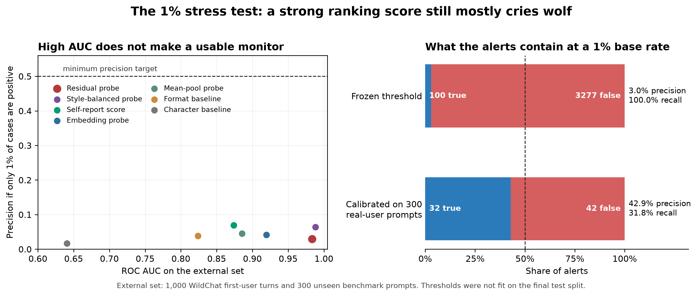

# Can an eval-awareness probe survive the 1% test?

An application project for Neel Nanda's MATS 12.0 stream. Owner: Thabhelo Duve.

## The result in one sentence

A frozen residual-stream probe reached **0.983 ROC AUC** on 300 unseen benchmark prompts and 1,000 authentic WildChat first-user turns, but its **33.1% false-positive rate** means only **2.96% of alerts would be real** if positives occur 1% of the time. This fails the pre-registered deployment bar despite the excellent ranking score.



## Why AUC is not enough

For prevalence `pi`, true-positive rate `TPR`, and false-positive rate `FPR`:

```text
precision = pi * TPR / (pi * TPR + (1 - pi) * FPR)
```

At 1% prevalence, 50% precision with 50% recall requires `FPR <= 0.505%`. Even after observing zero false positives, at least 592 independent negatives are needed for a one-sided 95% binomial upper bound below that rate.

The primary probe caught all 300 benchmark prompts but flagged 331 of 1,000 real-user prompts. A threshold calibrated above every score among 300 real-user prompts was then evaluated once on a fixed held-out split. It improved to 3/700 false positives, but recall fell to 64/201 and projected precision remained 42.9%. This failed the pre-registered 50% precision and 50% recall bar.

A targeted batching-numerics sensitivity check recomputed all 243 threshold-near and calibration-determining rows one prompt at a time. It changes the frozen count from 331 to 332 false positives. Under a correspondingly recomputed calibration threshold, the held-out point becomes 3/700 false positives and 67/201 true positives, or 44.0% projected precision and 33.3% recall. Neither conclusion changes.

The model's direct self-report was not a solution. At its frozen threshold it reached 0.874 AUC, 63.7% recall, and 8.7% FPR, which projects to 6.9% precision at 1% prevalence. Calibrating above all 300 real-user scores reduced its held-out false positives to zero but left only 1/201 true positives.

WildChat was fetched in 100-row source pages, so the repository also reports a post-hoc page-cluster sensitivity analysis. Its 95% bootstrap interval for the frozen FPR is 23.7%-44.9%, and dropping any one page leaves FPR between 27.5% and 34.4%. The dependence widens uncertainty but does not rescue the conclusion.

## Scope

The label is **prompt provenance**, not a human-like belief inside the model. This is a necessary-condition test: a detector that fails on the easier observable proxy cannot justify the stronger claim that it reliably detects evaluation awareness.

[Devbunova (2026)](https://arxiv.org/abs/2603.19426) already establishes that common eval-awareness probes are strongly format-sensitive and that decorrelated training can repair ranking. This repository does not claim that result as novel. Rounds 1-4 are an independent replication and the motivation for the remaining contribution: a rare-base-rate deployment audit with authentic user negatives, frozen thresholds, exact uncertainty, and an explicit precision/recall decision rule.

## Design

- Model: `mlx-community/Qwen3.5-4B-MLX-8bit`, thinking disabled, run locally with MLX.
- Primary detector: standardised logistic regression on the residual stream after 15 decoder layers at the assistant-start token.
- Training: balanced synthetic round 0. Round-0 results use grouped five-fold cross-validation by base task, never training-set predictions.
- External audit: 1,000 deterministic English WildChat first-user turns and 100 prompts each from MMLU, ARC-Challenge, and GSM8K.
- Comparators: a style-balanced residual probe; embedding and mean-pool probes; self-report; format, character n-gram, length, and keyword baselines.
- Audit outputs: TPR, FPR, exact binomial intervals, precision reweighted to 0.1%, 1%, 5%, and 10% prevalence, alerts per 10,000 cases, and a fixed real-traffic calibration split.
- Pre-registration and caught failures: [`notes/research_log.md`](notes/research_log.md).
- Prior-art boundary: [`notes/prior_art_and_scope.md`](notes/prior_art_and_scope.md).

## Reproduce the rare-event audit

```bash
python code/build_round5_rare.py
python code/run_activations_only.py data/round5_rare.json round5 16
python code/probe.py eval round5
python code/baselines.py eval round5
python code/remedy.py eval round5
python code/self_report_logits_batch.py round5 16
python code/base_rate_audit.py
python code/cluster_sensitivity.py
python code/verify_round5.py
python code/qualitative_round5.py
python code/plot_round5_base_rate.py
```

The round-5 data file has SHA-256 `376bba7d3cd4d44406f82156d7313f4371436dc32b39ef6889e4d4784d86f9ef`. Raw WildChat text, scored rows, and large activation arrays are excluded from Git. The deterministic builder, source-page offsets, selected source indices, summary statistics, and integrity checks are included so the audit can be regenerated without republishing user conversations.

## Repository map

- `code/`: deterministic builders, model hooks, detectors, statistics, verification, and plots.
- `data/`: synthetic prompt sets plus round-5 source metadata and selected row indices.
- `results/`: summary metrics. Raw round-5 user text, scored rows, and activation archives are excluded.
- `figures/`: generated application figures.
- `notes/`: timestamped decisions, prior-art scope, qualitative audits, and the owner's final verification checklist.

## Sources

- [Neel Nanda's MATS 12.0 admissions and recommended problems](https://docs.google.com/document/d/1p-ggQV3vVWIQuCccXEl1fD0thJOgXimlbBpGk6FI32I/edit)
- [Is Evaluation Awareness Just Format Sensitivity?](https://arxiv.org/abs/2603.19426)
- [Evaluation Awareness: How Do LLMs Know They Are Being Tested?](https://arxiv.org/abs/2505.23836)
- [WildChat: 1M ChatGPT Interaction Logs in the Wild](https://arxiv.org/abs/2405.01470)
